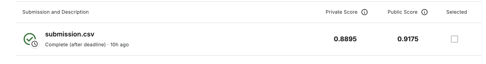

# Histopathologic Cancer Detection (Kaggle)

## Problem
Classify 96x96px microscope images to detect metastatic cancer in the center 32x32 region.

## Dataset
- train_labels.csv: image IDs and binary labels (1 = cancer, 0 = no cancer)
- train/: training images
- test/: test images for Kaggle submission

## Approach
Built a basic CNN with:
- Convolutional layers
- Batch Normalization & Dropout
- Early Stopping & Learning Rate Scheduler
- No data augmentation or class weighting

## Results
- Validation Accuracy: ~88%
- Internal Test Set: 100% (8 cancer + 8 no cancer)
- Kaggle AUC Score: 0.9175  

## Next Steps
- Try advanced models
- Add data augmentation
- Handle class imbalance
